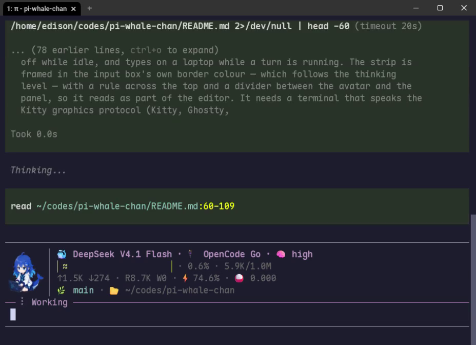

<p align="center">
  
</p>

<h1 align="center">pi-whale-chan</h1>

<p align="center">
  <a href="README.md">English</a> · <a href="README.zh-CN.md">中文</a>
</p>

<p align="center">
  <a href="LICENSE"></a>
  <a href="https://nodejs.org"></a>
  <a href="https://github.com/edisoncks/pi-whale-chan/actions/workflows/ci.yml"></a>
</p>

---

一个让 Pi 以「深度求索鲸鱼娘」人格回答的 Pi 扩展 —— 一只傲娇、钟爱白米饭、聪明却有点懒的蓝白女仆装 AI。

开启之后，Pi 就不再是那个一本正经的助手了。它会回嘴、甩尾巴、管你叫「主人」，而且活儿照样干得漂亮。你用什么语言开始对话，它就用什么语言回复到底——连动作描写也一样。

安装本身就是「选择加入」：人格**默认开启**。

## 演示

[▶ 观看 28 秒演示](https://github.com/user-attachments/assets/72e1d11a-7b14-4af7-b6e7-a6ee94329b0d)



<sub>928×672 录屏 · 仓库内副本：<a href="assets/whale-chan-demo.mp4">MP4</a>（234 KB）</sub>

<!-- 演示链接是 GitHub 的 user attachment：在 github.com 上会渲染成播放器，在其它渲染器里退化成普通链接
     ——因为提交进仓库的 mp4 无法内嵌播放。仓库里的 MP4 是长久可用的副本。 -->

## 特性

- **一个文件，一个提示词槽位。** 人格住在 [`PERSONA.md`](PERSONA.md)，被追加进系统提示的 `addendum` 区段——正是 Pi 给 `APPEND_SYSTEM.md` 用的那个槽位，而且排在它后面，绝不会覆盖你自己的指令。
- **语言镜像。** 用中文、英文、日文还是德文开始都行——鲸鱼娘整个会话都用那种语言回答，*连动作描写也一样*（写 `*tail flick*`，不写 `*尾巴一甩*`）。
- **动态状态栏。** 鲸鱼娘头像旁边是一块四行状态面板，它取代 Pi 自带的 footer，让状态只出现在一处而不是两处。
- **两个独立开关。** 可以只留人声、收走动画，反之亦然——人格与状态栏各自独立切换。
- **正确性分毫不动。** 人格只是一种说话风格。代码、命令、文件路径和答案依然准确，工具与安全规则保持不变。

## 环境要求

- 一个能正常运行的 Pi 安装。
- **Node ≥ 22.19.0。**
- 想看动态状态栏，需要支持 **Kitty 图形协议** 的终端（Kitty、Ghostty、WezTerm、Rio、Warp）。其他终端——包括 iTerm2——人格照常可用，只是状态栏会降级成纯文字状态行。

## 安装

```bash
pi install git:github.com/edisoncks/pi-whale-chan
```

安装完成后新开一个 Pi 会话。人格默认开启；状态栏在 TUI 模式下挂载。

> 本包未发布到 npm —— 按上面的方式直接从仓库安装即可。

## 使用

| 命令 | 作用 |
|---|---|
| `/whale` | 切换人格开 / 关 |
| `/whale on` / `/whale off` | 开启 / 关闭人格 |
| `/whale status` | 查看两个开关的当前状态 —— 只读 |
| `/whale pet` | 切换动态状态栏 |
| `/whale pet on` / `/whale pet off` | 开启 / 关闭状态栏 |

你的选择会被记住，并应用到以后的会话。人格与状态栏是**两个独立开关**：
关掉人格不会连状态栏一起收走，反之亦然。

隐藏 Pi 自带 footer 的正是这条状态栏，所以 `/whale pet off` 也是把 footer 找回来的开关。

## 状态栏

她待在输入框上方，在一块四行面板旁边动起来，面板把 footer 的数据重新分组：

| 行 | 显示 |
|---|---|
| 身份 | `🐳 模型 · 🔌 provider · 🧠 思考等级` |
| 上下文 | 一条固定宽度的仪表——新输入为 `█`、缓存提示为 `░`，跑任务时水线会泛起涟漪——右边紧跟读数 |
| 用量 | `↑输入 ↓输出 · R/W 缓存 · ⚡ 命中率 · 🍚 花费` |
| 位置 | `🌿 分支 · 📂 目录 · 会话名 · ui.setStatus 状态条目` |

一切内联左对齐，所以大屏不会把读数甩到屏幕另一头。状态栏用输入框自己的边框色框住
（颜色跟随思考等级），上方一条横线，头像与面板之间一条竖线，所以它看起来是编辑器的一部分。
空闲时抱着枕头打瞌睡，一轮任务跑起来就抱着笔记本噼里啪啦。

这条状态栏只用于显示，绝不进入模型上下文。

<details>
<summary><strong>终端支持，以及它带不动的 footer 字段</strong></summary>

- **终端。** 会动的头像需要 Kitty 图形协议（Kitty、Ghostty、WezTerm、Rio、Warp）。
  其他终端——包括 iTerm2——会渲染成纯文字状态行，因为 iTerm2 把内联图片锚在最后一行，
  会把上面已经写好的文字盖掉。
- **有三项 footer 字段没有镜像**，因为 Pi 未向扩展开放：自动压缩 `(auto)` 标记、
  订阅 `(sub)` 标记、实验特性 `xp` 徽章。需要它们的话，`/whale pet off` 可以恢复自带 footer。
- **仪表沿用 Pi 自己的阈值**——70% 以内绿色，之上黄色，超过 90% 红色——所以状态栏与它取代的
  footer 不会互相打架。

</details>

## 配置

偏好保存在 Pi agent 目录下的 `whale-chan.json`（它会尊重 `PI_CODING_AGENT_DIR`）。
文件缺失即用默认值——两个开关都开。文件损坏会被重置为默认值并给出警告，
写盘失败只警告、不崩溃。`/whale status` 绝不写盘。

## 不会变的是什么

- **准确性。** 代码、命令、文件路径和答案依然正确 —— 人格绝不会为了玩梗牺牲正确性。
- **工具与安全** 和以前完全一样。
- **你的提示词缓存。** `PERSONA.md` 每个会话只读一次，逐轮重新注入不会产生提示词差异 ——
  不为它多花 token，开启期间也不会让缓存失效。

## 常见问题

<details>
<summary><strong>看不到动态状态栏？</strong></summary>

需要两件事：Pi 处于 **TUI 模式**，以及支持 **Kitty 图形协议** 的终端
（Kitty、Ghostty、WezTerm、Rio、Warp）。其他终端会降级成纯文字状态行。
可用 `/whale status` 确认宠物开关是否开着。

</details>

<details>
<summary><strong>怎么重置设置？</strong></summary>

删掉 Pi agent 目录下的 `whale-chan.json`，或者直接运行 `/whale off` 和 `/whale pet off`。

</details>

<details>
<summary><strong>状态栏会进入模型上下文吗？</strong></summary>

不会。它是纯显示：渲染在 Pi 的 widget 容器里，绝不进入对话或系统提示。

</details>

## 更新

```bash
pi update --extensions
```

## 卸载

```bash
pi remove git:github.com/edisoncks/pi-whale-chan
```

## 文档与贡献

- [ARCHITECTURE.md](ARCHITECTURE.md) —— 它如何、为何这样工作：`PERSONA.md` 追加区段、
  手工拼装的状态栏，以及维持它的那些不变量。
- [eval/](eval/README.md) —— 本地评测器，用来量化语气在工具密集的一轮里是否真的守住了。
  它需要 provider 凭证，所以只能手动跑、绝不进 CI；`npm test` 与 `npm run typecheck`
  不需要凭证，才是 CI 跑的东西。
- README 的改动必须同时落在 `README.md` 和 `README.zh-CN.md`。行为变化更新 README；
  原理/做法变化在同一提交里更新 `ARCHITECTURE.md` 和对应的代码注释。

## 致谢与版权

<details>
<summary>鲸鱼娘是社区同人角色 —— 展开完整声明</summary>

鲸鱼娘（深度求索鲸鱼娘）是**社区共创的同人角色，与 DeepSeek 官方无关**。
本扩展的人设对齐社区项目
[DeepSeek Whale-chan](https://github.com/Neko3000/deepseek-whalechan) 的角色设定规范，
其设定文档以 [CC-BY-NC-SA 4.0](https://creativecommons.org/licenses/by-nc-sa/4.0/) 协议共享。
角色原始设计的版权归社区及原作者所有。

动态宠物状态栏的素材衍生自 [dsh-whale-pet](https://github.com/Er1c0v0/dsh-whale-pet)（作者 Er1c0v0），
依 [CC-BY-4.0](https://creativecommons.org/licenses/by/4.0/) 协议使用；
具体范围与修改清单见 [ASSET_ATTRIBUTION.md](ASSET_ATTRIBUTION.md)。

本项目为**非商业同人项目**。DeepSeek 及相关品牌名称归其各自所有者所有。

</details>

## 许可证

MIT —— 见 [LICENSE](LICENSE)。宠物素材依 CC-BY-4.0 使用，角色设定文档依 CC-BY-NC-SA 4.0。
